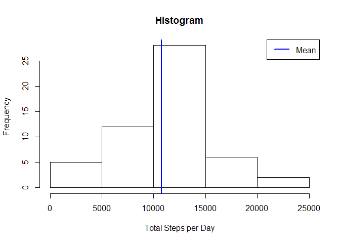
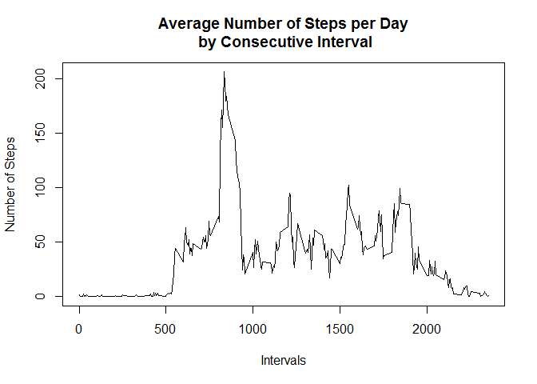
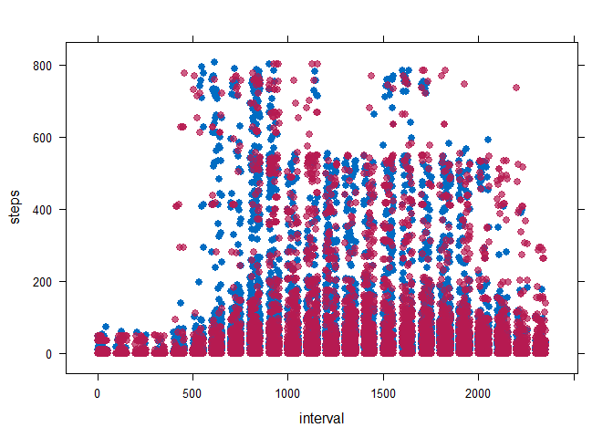
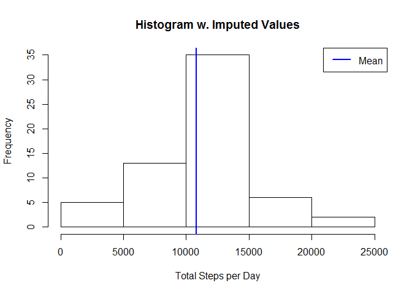
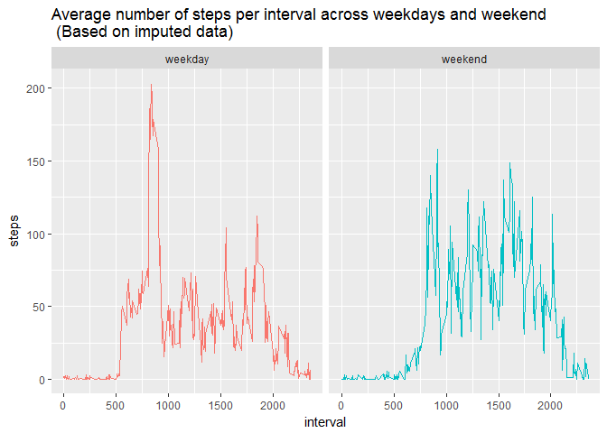

# PA1_template.Rmd
Polina Filipova  
April 30, 2017  

<a name="top"></a>

## Overview

This document is generated for an asignment under the <b>Reproducible Research</b> course, offered by Johns Hopkins University on Coursera.<br><br>

<blockquote>&nbsp;&nbsp; It is now possible to collect a large amount of data about personal movement using activity monitoring devices such as a Fitbit, Nike Fuelband, or Jawbone Up. These type of devices are part of the "quantified self" movement - a group of enthusiasts who take measurements about themselves regularly to improve their health, to find patterns in their behavior, or because they are tech geeks. But these data remain under-utilized both because the raw data are hard to obtain and there is a lack of statistical methods and software for processing and interpreting the data.<br>

&nbsp;&nbsp; This assignment makes use of data from a personal activity monitoring device. This device collects data at 5 minute intervals through out the day. The data consists of two months of data from an anonymous individual collected during the months of October and November, 2012 and include the number of steps taken in 5 minute intervals each day.</blockquote>

The data for this assignment can be downloaded from the course web site:

* [Activity monitoring data](https://d396qusza40orc.cloudfront.net/repdata%2Fdata%2Factivity.zip)<br><br>

The following required items can be reviewed below:

1.  [Code for reading in the dataset and/or processing the data](#step1) 
2.  [Mean and median number of steps taken each day](#step2) 
3.  [Histogram of the total number of steps taken each day](#step3) 
4.  [The 5-minute interval that, on average, contains the maximum number of steps](#step4) 
5.  [Time series plot of the average number of steps taken](#step5) 
6.  [Code to describe and show a strategy for imputing missing data](#step6) 
7.  [Histogram of the total steps per day after missing values are imputed](#step7) 
8.  [Panel plot comparing average steps per 5-minute interval across weekdays and weekends](#step8) 
9.  [All of the R code needed to reproduce the results (numbers, plots, etc.)](#step9) 


### <a name="step1"></a>1. Read and Review Data

Note: This will search for content in the current working directory for your R environment.


```r
# Check if we already have the data. If not, fetch and extract it:
if(!file.exists("activity.csv") | !file.exists("repdata%2Fdata%2Factivity.zip"))
        {
  temp <- tempfile()
  download.file("https://d396qusza40orc.cloudfront.net/repdata%2Fdata%2Factivity.zip",temp)
  file <- unzip(temp)
  unlink(temp)
        }
```


```r
activityData <- read.csv("activity.csv", header=TRUE, sep=",", stringsAsFactor=FALSE, na.strings="NA")
str(activityData)
```

```
## 'data.frame':	17568 obs. of  3 variables:
##  $ steps   : int  NA NA NA NA NA NA NA NA NA NA ...
##  $ date    : chr  "2012-10-01" "2012-10-01" "2012-10-01" "2012-10-01" ...
##  $ interval: int  0 5 10 15 20 25 30 35 40 45 ...
```

[Back to Overview](#top)


### <a name="step2"></a>2. Mean and median number of steps taken each day


```r
# Sum total of the number of steps per day:
stepsTotal <- aggregate(steps~date, data=activityData, sum, na.rm=TRUE)

# Fetch and store the mean and median number of steps per day:
stepsTotal.mean <- mean(stepsTotal$steps)
stepsTotal.median <- median(stepsTotal$steps)
```


```r
stepsTotal.mean
```

```
## [1] 10766.19
```


```r
stepsTotal.median
```

```
## [1] 10765
```

[Back to Overview](#top)


### <a name="step3"></a>3. Histogram of the total number of steps taken each day

We saw mean and median to be very close, wherefore the scope of the histogram does not allow to accurately represent both. We will still note the mean.


```r
hist(stepsTotal$steps, xlab="Total Steps per Day", main="Histogram")  
abline(v = stepsTotal.mean, col="blue", lwd=2)
legend(x="topright", "Mean", col = c("blue"), lwd=2)
```

<!-- -->

[Back to Overview](#top)


### <a name="step4"></a>4. The 5-minute interval that, on average, contains the maximum number of steps


```r
# From the data, we know the intervals are 5 minute each.
# Therefore, we can pick the one feat. maximum number of steps without further preprocessing.

# Average number of steps taken across all days:
stepsAvg <- aggregate(steps~interval, data=activityData, mean, na.rm=TRUE)

# Get the interval feat. maximum number of steps:
intervalMax <-stepsAvg[which.max(stepsAvg$steps),1]

# Get the maximum number of steps itself:
stepsMax <- max(stepsAvg$steps)
```


```r
intervalMax
```

```
## [1] 835
```


```r
stepsMax
```

```
## [1] 206.1698
```

[Back to Overview](#top)


### <a name="step5"></a>5. Time series plot of the average number of steps taken


```r
plot(stepsAvg$interval, stepsAvg$steps, type="l", xlab="Intervals", ylab="Number of Steps", main="Average Number of Steps per Day\n by Consecutive Interval")
```

<!-- -->

[Back to Overview](#top)


### <a name="step5"></a>6. Code to describe and show a strategy for imputing missing data

Mean-derived data is a popular methods of filling in the gaps. 

Let's do a "before" and "after" exercise:


```r
# Calculate total number of values and total number of missing values in the dataset:
valuesTotal <- length(activityData$steps)
valuesNATotal <- length(which(is.na(activityData$steps)))
```

Before:


```r
# Total number of values:
valuesTotal
```

```
## [1] 17568
```


```r
# Total number of N/A values:
valuesNATotal
```

```
## [1] 2304
```


```r
# Missing values as a percentage of total values:
(valuesNATotal/valuesTotal)*100
```

```
## [1] 13.11475
```

Fill in the missing observations with mean-derived data:


```r
# Important note: The "impute" package is no longer available on Cran.
# It makes a fine mess in R version 3.3.2, 3.4.0.
# If you are confident working with "impute", you can get it from BioConductor.
# We will use the "mice" package instead, to invoke predictive mean matching (PMM).

if(!require(mice)) { install.packages("mice") }
```

```
## Loading required package: mice
```

```r
library(mice)

tempData <- mice(activityData, m=5, maxit=10, method='pmm', seed=1, printFlag=FALSE)
imputedData <- complete(tempData,1)

valuesTotalImp <- length(imputedData$steps)
valuesNATotalImp <- length(which(is.na(imputedData$steps)))
```

After adjustment:


```r
# Total number of values:
    valuesTotalImp
```

```
## [1] 17568
```


```r
# Total number of N/A values:
    valuesNATotalImp
```

```
## [1] 0
```

We can as well have a look of the differences:


```r
if(!require(lattice)) { install.packages("lattice") }
```

```
## Loading required package: lattice
```


```r
library(lattice)

 xyplot(tempData, steps~interval, col=mdc(1:2), pch=20, cex=1.5)
```

<!-- -->

[Back to Overview](#top)


### <a name="step5"></a>7. Histogram of the total steps per day after missing values are imputed

Earlier, we created the histogram without NA values. Now with the NA values imputed, we get:


```r
# Get total number of steps per day based on imputed data:
stepsTotalImp <- aggregate(steps~date, data=imputedData, sum)

# Get mean of steps per day based on imputed data:
stepsTotalImp.mean <- mean(stepsTotalImp$steps)
stepsTotalImp.median <- median(stepsTotalImp$steps)
```


```r
stepsTotalImp.mean
```

```
## [1] 10804.49
```


```r
stepsTotalImp.median
```

```
## [1] 10765
```

With our simple histogram approach from before, it would still be difficult for the human eye to distinguish the mean and median values. Here's the mean for show, again.


```r
# Print histogram:
hist(stepsTotalImp$steps, xlab="Total Steps per Day", main="Histogram w. Imputed Values")  
abline(v = stepsTotalImp.mean, col="blue", lwd=2)
legend(x="topright", "Mean", col = c("blue"), lwd=2)
```

<!-- -->

[Back to Overview](#top )


### <a name="step5"></a>8. Panel plot comparing average steps per 5-minute interval across weekdays and weekends


```r
# Factor in weekday and wekeend data.

imputedData[, 2] <- as.Date(imputedData[, 2])

imputedDataWeekend <- c('Saturday', 'Sunday')

imputedData$daytype <- factor((weekdays(imputedData$date) %in% imputedDataWeekend), levels=c(FALSE, TRUE), labels=c('weekday','weekend'))

imputedDataAvgWeek <- aggregate(steps~interval+daytype, data=imputedData, mean)
```


```r
if(!require(ggplot2)) { install.packages("ggplot2") }
```

```
## Loading required package: ggplot2
```


```r
library(ggplot2)

qplot(interval, steps, data=imputedDataAvgWeek, color=daytype, geom="path", facets=.~daytype) + ggtitle("Average number of steps per interval across weekdays and weekend\n (Based on imputed data)") + theme(legend.position="none")
```

<!-- -->

This is curious - it appears that the test subjects start weekday training with higher enthusiasm overall.

[Back to Overview](#top)


### <a name="step5"></a>9. All of the R code needed to reproduce the results (numbers, plots, etc.)

Please refer to the parent folder of this GitHub submission for the PA1_template.Rmd file.


[Back to Overview](#top)
